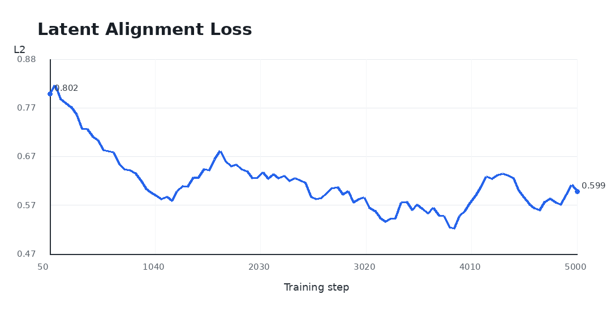
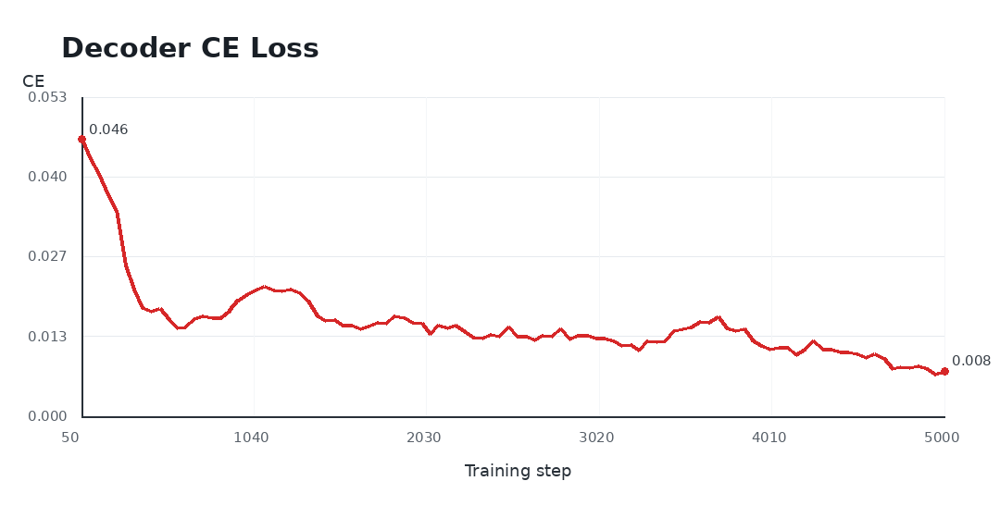

# ELFCAPS

ELFCAPS is an ELF-based audio captioning project for AudioCaps-style audio understanding. It uses an audio-prefix-conditioned ELF backbone and a T5-small latent text decoder to generate natural-language captions from audio features.

ELFCAPS trains on precomputed PE-a-frame audio features. The PE-a-frame audio encoder is used as a frozen feature extractor rather than trained end-to-end from raw waveform to caption.

## Repository Layout

```text
ELFCAPS/
├── README.md
├── LICENSE
├── requirements.txt
├── configs/                 # model and sampling configs
├── src/                     # training, inference, model, and utility code
├── scripts/                 # train / infer / evaluate entrypoints
├── checkpoints/release/     # place the released Orbax checkpoint here
├── demo/                    # JSON inference examples
├── eval/                    # reported AudioCaps 1.0 metrics
└── assets/                  # training figures
```

This is a clean single-checkpoint base model package. Inference uses one checkpoint and standard sampling settings.

## Installation

```bash
cd ELFCAPS
conda create -n elfcaps python=3.10 -y
conda activate elfcaps
pip install -r requirements.txt
```

## Checkpoint

Place the released Orbax checkpoint directory at:

```text
checkpoints/release/checkpoint
```

The scripts use this path by default. You can override it with `CHECKPOINT=/path/to/checkpoint`.

## Data Layout

Expected AudioCaps-style layout:

```text
data/audiocaps2/train.csv
data/audiocaps2/val.csv
data/audiocaps2/audiocaps_raw_audio/<youtube_id>_<start_time>.wav
data/audiocaps_pe_features/<youtube_id>_<start_time>.npy
data/audiocaps1_test.csv
data/audiocaps1_test_refs.csv
```

The paths are configurable in `configs/elfcaps_audiocaps2.yml` and through script environment variables.

To prepare audio features, run `src/extract_audio_features.py` on the AudioCaps-style CSV splits. Training reads the resulting `.npy` files from `data/audiocaps_pe_features/`.

## Inference

Default settings:

```text
num_sampling_steps=16
cfg_scale=3
self_cond_cfg_scale=1
max_decode_tokens=32
min_decode_tokens=6
clean_artifacts=true
use_raw_params=true
```

Quick inference from the repository root:

```bash
bash scripts/infer.sh data/audiocaps1_test.csv 10 outputs/evals/elfcaps_demo.jsonl
```

The output is JSONL with `input`, `target`, and `prediction` fields.

## Training

Primary config:

```text
configs/elfcaps_audiocaps2.yml
```

Important fields:

```text
model: ELF-B
max_length: 96
audio_num_prefix_tokens: 32
audio_feature_dim: 1024
encoder_model_name: t5-small
self_cond_prob: 0.5
decoder_prob: 0.35
trajectory_decoder_ce_weight: 0.05
```

Reproduction training command from the repository root:

```bash
bash scripts/train.sh
```

This trains the captioning model on frozen PE-a-frame features. It does not update the PE-a-frame audio encoder.

## Evaluation

Set the AudioCaps 1.0 test and 5-reference CSV paths if they differ from the defaults:

```bash
export AUDIOCAPS_TEST_CSV=data/audiocaps1_test.csv
export AUDIOCAPS_REFS_CSV=data/audiocaps1_test_refs.csv
bash scripts/evaluate.sh
```

The evaluation script generates captions on AudioCaps 1.0 test, attaches the 5-reference table, and computes BLEU, ROUGE-L, METEOR, CIDEr, SPICE, and SPIDEr.

## ELFCAPS AudioCaps 1.0 Test Results

Full 957-row AudioCaps 1.0 test, evaluated with 5 references:

| Model | BLEU1 | BLEU4 | ROUGE-L | METEOR | CIDEr | SPICE | SPIDEr |
|---|---:|---:|---:|---:|---:|---:|---:|
| ELFCAPS | 51.19 | 13.51 | 42.58 | 31.46 | 22.26 | 10.55 | 16.41 |

Machine-readable files:

```text
eval/audiocaps1_test_metrics.json
eval/audiocaps1_test_summary.json
```

## Comparison With WavCaps Paper Metrics

Reference paper: [WavCaps: A ChatGPT-Assisted Weakly-Labelled Audio Captioning Dataset for Audio-Language Multimodal Research](https://arxiv.org/pdf/2303.17395).

The comparable task is automated audio captioning on AudioCaps using BLEU1, BLEU4, ROUGE-L, METEOR, CIDEr, SPICE, and SPIDEr. Training data is different, so this table is a metric-scale reference rather than a controlled apples-to-apples comparison.

| Model | Training Data | BLEU1 | BLEU4 | ROUGE-L | METEOR | CIDEr | SPICE | SPIDEr |
|---|---|---:|---:|---:|---:|---:|---:|---:|
| ELFCAPS | AudioCaps 2.0 | 51.19 | 13.51 | 42.58 | 31.46 | 22.26 | 10.55 | 16.41 |
| CNN14-BART baseline | AudioCaps | 67.0 | 26.1 | 48.3 | 23.1 | 72.1 | 16.9 | 44.5 |
| CNN14-BART | WavCaps + AudioCaps | 69.3 | 27.2 | 49.9 | 24.7 | 75.6 | 17.9 | 46.8 |
| HTSAT-BART | WavCaps + AudioCaps | 70.7 | 28.3 | 50.7 | 25.0 | 78.7 | 18.2 | 48.5 |

## Demo Examples

The following 10 selected examples were generated with the release checkpoint and default inference settings. Audio files are included under `demo/audio/`.

<table>
  <thead>
    <tr>
      <th>#</th>
      <th>Audio</th>
      <th>Reference caption</th>
      <th>ELFCAPS prediction</th>
    </tr>
  </thead>
  <tbody>
  <tr>
    <td>1</td>
    <td><audio controls preload="none" src="demo/audio/SGaIvgwwWSE_30.wav"></audio><br><code>SGaIvgwwWSE_30.wav</code></td>
    <td>Rain falling on a hard surface as thunder roars in the distance</td>
    <td>rain falls onto a hard surface and thunders</td>
  </tr>
  <tr>
    <td>2</td>
    <td><audio controls preload="none" src="demo/audio/Bz9Y5nZK3eo_21.wav"></audio><br><code>Bz9Y5nZK3eo_21.wav</code></td>
    <td>Fast and loud typing on computer keyboard</td>
    <td>a person is typing on a computer keyboard</td>
  </tr>
  <tr>
    <td>3</td>
    <td><audio controls preload="none" src="demo/audio/7XXSOzDQ2z0_70.wav"></audio><br><code>7XXSOzDQ2z0_70.wav</code></td>
    <td>An engine throttles and clanks and then suddenly accelerates off into the distance</td>
    <td>a vehicle engine accelerates and revs</td>
  </tr>
  <tr>
    <td>4</td>
    <td><audio controls preload="none" src="demo/audio/BZCEDkx37rI_15.wav"></audio><br><code>BZCEDkx37rI_15.wav</code></td>
    <td>A vehicle engine revving then running idle followed by cloth shuffling</td>
    <td>a vehicle engine idles and revs</td>
  </tr>
  <tr>
    <td>5</td>
    <td><audio controls preload="none" src="demo/audio/CwxgQS3SXic_160.wav"></audio><br><code>CwxgQS3SXic_160.wav</code></td>
    <td>A sewing machine operating</td>
    <td>a sewing machine runs</td>
  </tr>
  <tr>
    <td>6</td>
    <td><audio controls preload="none" src="demo/audio/4bUL_ttiOdw_21.wav"></audio><br><code>4bUL_ttiOdw_21.wav</code></td>
    <td>A baby cries continuously</td>
    <td>a baby cries</td>
  </tr>
  <tr>
    <td>7</td>
    <td><audio controls preload="none" src="demo/audio/9b6RqajfAmw_30.wav"></audio><br><code>9b6RqajfAmw_30.wav</code></td>
    <td>Pigeons cooing and flapping their wings</td>
    <td>pigeons coo and birds chirping</td>
  </tr>
  <tr>
    <td>8</td>
    <td><audio controls preload="none" src="demo/audio/67BsqRkh-dU_10.wav"></audio><br><code>67BsqRkh-dU_10.wav</code></td>
    <td>A toilet flushing as music is playing and a man is singing in the distance</td>
    <td>a toilet flushes and water splashes</td>
  </tr>
  <tr>
    <td>9</td>
    <td><audio controls preload="none" src="demo/audio/4ftDFi4684Y_30.wav"></audio><br><code>4ftDFi4684Y_30.wav</code></td>
    <td>Light rustling followed by faint ticks of a clock</td>
    <td>a clock tick-tocks</td>
  </tr>
  <tr>
    <td>10</td>
    <td><audio controls preload="none" src="demo/audio/2a6GNu6uCDE_30.wav"></audio><br><code>2a6GNu6uCDE_30.wav</code></td>
    <td>A woman talking in an auditorium</td>
    <td>a woman gives a speech</td>
  </tr>
  </tbody>
</table>

The same examples are saved in `demo/infer_examples.json`.

## Training Curves

The release training objective has two main parts: latent alignment keeps audio-conditioned text latents close to teacher caption latents, and decoder CE keeps those latents decodable as text. Both curves are smoothed for readability.

<p align="center">
  
</p>

<p align="center">
  
</p>

## Acknowledgements

ELFCAPS builds on and uses resources from the following papers, datasets, models, and repositories:

- [ELF: Embedded Language Flows](https://arxiv.org/abs/2605.10938) and its [official repository](https://github.com/lillian039/ELF) for the base language-flow framework.
- [AudioCaps](https://audiocaps.github.io/) for the audio captioning dataset and evaluation setting.
- [WavCaps](https://arxiv.org/pdf/2303.17395) and its [official repository](https://github.com/XinhaoMei/WavCaps) for related audio captioning metrics and comparison references.
- [T5](https://arxiv.org/abs/1910.10683) for the text encoder / latent text representation.
- [facebook/pe-a-frame-small](https://huggingface.co/facebook/pe-a-frame-small) for the audio feature extraction backbone used in this project.
- [pycocoevalcap](https://github.com/salaniz/pycocoevalcap) for CIDEr, SPICE, and related captioning metrics.
