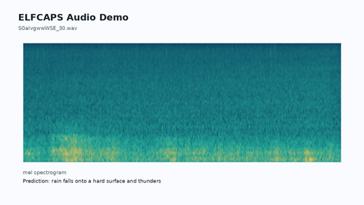
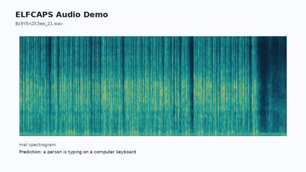
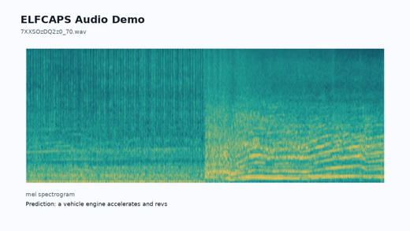
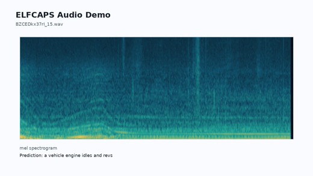
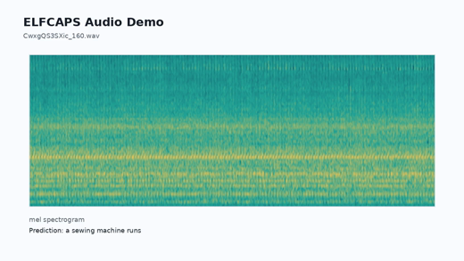
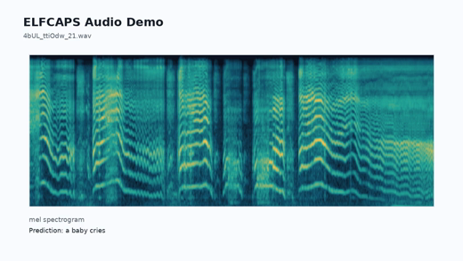
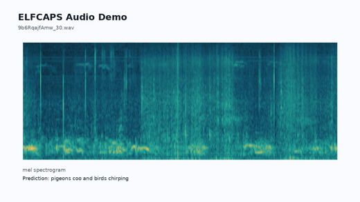
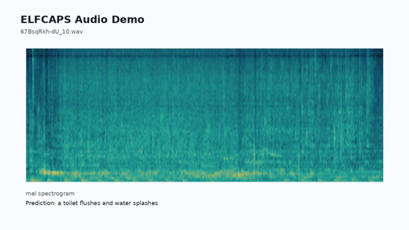
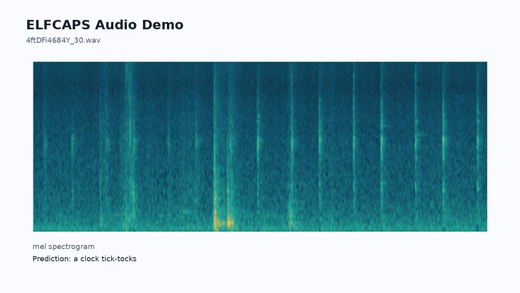
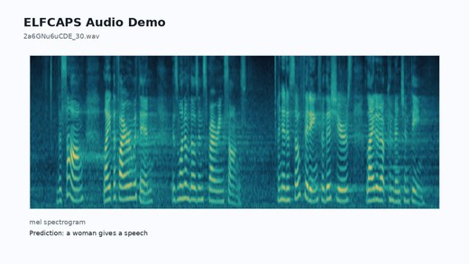

# ELFCAPS

ELFCAPS is an ELF-based audio captioning project for AudioCaps-style audio understanding. It uses an audio-prefix-conditioned ELF backbone and a T5-small latent text decoder to generate natural-language captions from audio features.

ELFCAPS trains on precomputed PE-a-frame audio features. The PE-a-frame audio encoder is used as a frozen feature extractor rather than trained end-to-end from raw waveform to caption.

## Results

Full 957-row AudioCaps 1.0 test, evaluated with 5 references:

| Model | BLEU1 | BLEU4 | ROUGE-L | METEOR | CIDEr | SPICE | SPIDEr |
|---|---:|---:|---:|---:|---:|---:|---:|
| ELFCAPS | 51.19 | 13.51 | 42.58 | 31.46 | 22.26 | 10.55 | 16.41 |

Machine-readable files: `eval/audiocaps1_test_metrics.json` and `eval/audiocaps1_test_summary.json`.

### WavCaps Paper Reference

Reference paper: [WavCaps: A ChatGPT-Assisted Weakly-Labelled Audio Captioning Dataset for Audio-Language Multimodal Research](https://arxiv.org/pdf/2303.17395). Training data is different, so this table is a metric-scale reference rather than a controlled apples-to-apples comparison.

| Model | Training Data | BLEU1 | BLEU4 | ROUGE-L | METEOR | CIDEr | SPICE | SPIDEr |
|---|---|---:|---:|---:|---:|---:|---:|---:|
| ELFCAPS | AudioCaps 2.0 | 51.19 | 13.51 | 42.58 | 31.46 | 22.26 | 10.55 | 16.41 |
| CNN14-BART baseline | AudioCaps | 67.0 | 26.1 | 48.3 | 23.1 | 72.1 | 16.9 | 44.5 |
| CNN14-BART | WavCaps + AudioCaps | 69.3 | 27.2 | 49.9 | 24.7 | 75.6 | 17.9 | 46.8 |
| HTSAT-BART | WavCaps + AudioCaps | 70.7 | 28.3 | 50.7 | 25.0 | 78.7 | 18.2 | 48.5 |

## Demo Examples

The following selected examples were generated with the release checkpoint and default inference settings. GitHub README reliably renders the mel images below; the linked HTML demo provides full audio/video players for the same examples.

[Open the full audio demo page](demo/audio_demo.html).

| # | Mel / audio | Reference caption | ELFCAPS prediction |
|---:|---|---|---|
| 1 | <br>[SGaIvgwwWSE_30.wav](demo/audio/SGaIvgwwWSE_30.wav) | Rain falling on a hard surface as thunder roars in the distance | rain falls onto a hard surface and thunders |
| 2 | <br>[Bz9Y5nZK3eo_21.wav](demo/audio/Bz9Y5nZK3eo_21.wav) | Fast and loud typing on computer keyboard | a person is typing on a computer keyboard |
| 3 | <br>[7XXSOzDQ2z0_70.wav](demo/audio/7XXSOzDQ2z0_70.wav) | An engine throttles and clanks and then suddenly accelerates off into the distance | a vehicle engine accelerates and revs |
| 4 | <br>[BZCEDkx37rI_15.wav](demo/audio/BZCEDkx37rI_15.wav) | A vehicle engine revving then running idle followed by cloth shuffling | a vehicle engine idles and revs |
| 5 | <br>[CwxgQS3SXic_160.wav](demo/audio/CwxgQS3SXic_160.wav) | A sewing machine operating | a sewing machine runs |
| 6 | <br>[4bUL_ttiOdw_21.wav](demo/audio/4bUL_ttiOdw_21.wav) | A baby cries continuously | a baby cries |
| 7 | <br>[9b6RqajfAmw_30.wav](demo/audio/9b6RqajfAmw_30.wav) | Pigeons cooing and flapping their wings | pigeons coo and birds chirping |
| 8 | <br>[67BsqRkh-dU_10.wav](demo/audio/67BsqRkh-dU_10.wav) | A toilet flushing as music is playing and a man is singing in the distance | a toilet flushes and water splashes |
| 9 | <br>[4ftDFi4684Y_30.wav](demo/audio/4ftDFi4684Y_30.wav) | Light rustling followed by faint ticks of a clock | a clock tick-tocks |
| 10 | <br>[2a6GNu6uCDE_30.wav](demo/audio/2a6GNu6uCDE_30.wav) | A woman talking in an auditorium | a woman gives a speech |

The same examples are saved in `demo/infer_examples.json`, with raw audio under `demo/audio/`, mel images under `demo/mel/`, and mel videos under `demo/video/`.

## Training Curves

The release training objective has two main parts: latent alignment keeps audio-conditioned text latents close to teacher caption latents, and decoder CE keeps those latents decodable as text. Both curves are smoothed for readability.

<p align="center">
  
</p>

<p align="center">
  
</p>

## Installation

```bash
cd ELFCAPS
conda create -n elfcaps python=3.10 -y
conda activate elfcaps
pip install -r requirements.txt
```

## Checkpoint

Place the released Orbax checkpoint directory at:

```text
checkpoints/release/checkpoint
```

The scripts use this path by default. You can override it with `CHECKPOINT=/path/to/checkpoint`.

## Data Layout

Expected AudioCaps-style layout:

```text
data/audiocaps2/train.csv
data/audiocaps2/val.csv
data/audiocaps2/audiocaps_raw_audio/<youtube_id>_<start_time>.wav
data/audiocaps_pe_features/<youtube_id>_<start_time>.npy
data/audiocaps1_test.csv
data/audiocaps1_test_refs.csv
```

The paths are configurable in `configs/elfcaps_audiocaps2.yml` and through script environment variables. To prepare audio features, run `src/extract_audio_features.py`; training reads the resulting `.npy` files from `data/audiocaps_pe_features/`.

## Inference

Default settings:

```text
num_sampling_steps=16
cfg_scale=3
self_cond_cfg_scale=1
max_decode_tokens=32
min_decode_tokens=6
clean_artifacts=true
use_raw_params=true
```

Quick inference from the repository root:

```bash
bash scripts/infer.sh data/audiocaps1_test.csv 10 outputs/evals/elfcaps_demo.jsonl
```

The output is JSONL with `input`, `target`, and `prediction` fields.

## Training

Primary config: `configs/elfcaps_audiocaps2.yml`

Important fields:

```text
model: ELF-B
max_length: 96
audio_num_prefix_tokens: 32
audio_feature_dim: 1024
encoder_model_name: t5-small
self_cond_prob: 0.5
decoder_prob: 0.35
trajectory_decoder_ce_weight: 0.05
```

Reproduction training command from the repository root:

```bash
bash scripts/train.sh
```

This trains the captioning model on frozen PE-a-frame features. It does not update the PE-a-frame audio encoder.

## Evaluation

Set the AudioCaps 1.0 test and 5-reference CSV paths if they differ from the defaults:

```bash
export AUDIOCAPS_TEST_CSV=data/audiocaps1_test.csv
export AUDIOCAPS_REFS_CSV=data/audiocaps1_test_refs.csv
bash scripts/evaluate.sh
```

The evaluation script generates captions on AudioCaps 1.0 test, attaches the 5-reference table, and computes BLEU, ROUGE-L, METEOR, CIDEr, SPICE, and SPIDEr.

## Repository Layout

```text
ELFCAPS/
├── README.md
├── LICENSE
├── requirements.txt
├── configs/                 # model and sampling configs
├── src/                     # training, inference, model, and utility code
├── scripts/                 # train / infer / evaluate entrypoints
├── checkpoints/release/     # place the released Orbax checkpoint here
├── demo/                    # JSON and audio demo examples
├── eval/                    # reported AudioCaps 1.0 metrics
└── assets/                  # training figures
```

This is a clean single-checkpoint base model package. Inference uses one checkpoint and standard sampling settings.

## Acknowledgements

ELFCAPS builds on and uses resources from the following papers, datasets, models, and repositories:

- [ELF: Embedded Language Flows](https://arxiv.org/abs/2605.10938) and its [official repository](https://github.com/lillian039/ELF) for the base language-flow framework.
- [AudioCaps](https://audiocaps.github.io/) for the audio captioning dataset and evaluation setting.
- [WavCaps](https://arxiv.org/pdf/2303.17395) and its [official repository](https://github.com/XinhaoMei/WavCaps) for related audio captioning metrics and comparison references.
- [T5](https://arxiv.org/abs/1910.10683) for the text encoder / latent text representation.
- [facebook/pe-a-frame-small](https://huggingface.co/facebook/pe-a-frame-small) for the audio feature extraction backbone used in this project.
- [pycocoevalcap](https://github.com/salaniz/pycocoevalcap) for CIDEr, SPICE, and related captioning metrics.
